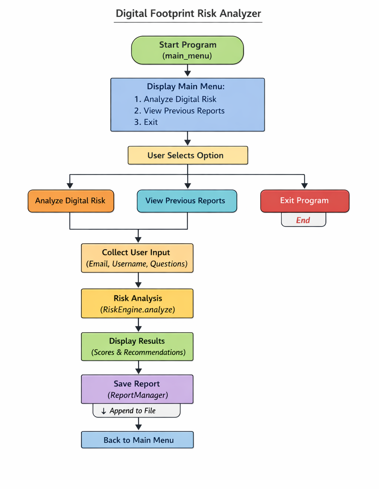

🔐 Digital Footprint Risk Analyzer

A Python-based cybersecurity tool that analyzes a user's digital habits and calculates a Digital Risk Score (0-100) based on multiple exposure factors such as passwords, usernames, email patterns, privacy settings, and online behavior.

This tool helps users understand their online security posture and provides recommendations to reduce their digital exposure.

🚀 Features
Feature	Description	Risk Weight
🔑 Password Risk Analysis	Evaluates password strength & reuse	0-25
📧 Email Risk Analysis	Detects predictable email patterns	0-15
👤 Username Exposure Risk	Checks risky username patterns	0-15
🌐 Privacy Exposure Risk	Evaluates public information sharing	0-15
🧠 Behavior Risk	Analyzes cybersecurity habits	0-10
🚨 Breach Simulation	Simulates potential breach exposure	0-20
📊 Risk Classification
Score	Risk Level
0-30	🟢 Low Risk
31-60	🟡 Moderate Risk
61-100	🔴 High Risk

## 🧩 Project Architecture

### 📊 Flowchart


## 📂 Project Structure
```
Digital-Footprint-Risk-Analyzer

├── backend  
│   ├── main.py  
│   ├── risk_engine.py  
│   ├── report_manager.py  
│   ├── utils.py  
│   └── reports.txt  

├── frontend  
│   ├── index.html  
│   └── static  
│       ├── style.css  
│       └── app.js  

├── Flowchart.png  
└── README.md
```
⚙️ Installation

No external dependencies required.

Requirements:

Python 3.x

Clone the repository:
```
git clone https://github.com/vr8010/Digital-Footprint-Risk-Analyzer.git
```
Navigate to the project folder:
```
cd Digital-Footprint-Risk-Analyzer
```
▶️ Usage

Run the application:
```
python main.py
```
📋 Menu Options

1️⃣ Analyze Digital Risk
Runs a new digital risk analysis.

2️⃣ View Previous Reports
Displays previously saved risk reports.

3️⃣ Exit
Closes the application.
```
📊 Example Output
--------------------------------------------------
 Password Risk:        14/25
 Email Risk:           8/15
 Username Risk:        10/15
 Privacy Risk:         7/15
 Behavior Risk:        6/10
 Breach Simulation:    15/20
--------------------------------------------------
 TOTAL DIGITAL RISK SCORE: 60/100
 RISK LEVEL: MODERATE ⚠️
--------------------------------------------------

 RECOMMENDATIONS:
 - Increase password complexity
 - Avoid password reuse
 - Remove birth year from username
🛠 Technical Highlights
```
Pure Python implementation

Object-Oriented Risk Engine

Console-based interactive UI

Persistent report storage using file handling

Input validation and error handling

Modular code architecture

🔮 Future Improvements

GUI version (Tkinter / Web Dashboard)

Integration with breach databases

Password entropy calculation

Web version using Flask

👨‍💻 Author

Vishal Rathod

GitHub
https://github.com/vr8010

⭐ Support

If you find this project useful, please consider giving it a ⭐ on GitHub.
